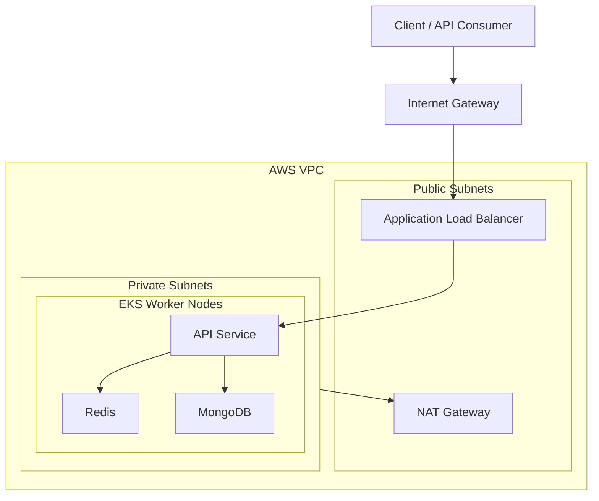

# Session Management API

A Flask-based service for creating, retrieving, and deleting user sessions using MongoDB for persistent storage and Redis for high-performance caching, fully containerized with Docker, orchestrated using Kubernetes, and deployed to AWS EKS via Terraform.

## Features

### API Functionality
- Create, fetch, and delete session documents
- Sliding expiration using TTL refresh on access
- Hybrid storage system:
  - Redis → high-speed in-memory caching
  - MongoDB → persistent session store

### DevOps & Infrastructure
- Dockerized services: Flask API, MongoDB, Redis
- Docker Compose for local multi-container development
- Kubernetes Deployments & Services (Docker Desktop cluster)
- Terraform IaC provisioning:
  - VPC, subnets, routing
  - EKS cluster, managed node groups
  - Automated cluster provisioning and repeatable deployments
- Horizontal scaling through Kubernetes replica sets

### Engineering Focus
- Multi-layer caching design (Redis → MongoDB)
- Session lifecycle + TTL synchronization
- Cloud architecture practice: containers, orchestration, IaC, EKS networking

## Architecture Overview


## Project Structure
```
session-api/
├── app/
│   ├── app.py
│   ├── requirements.txt
│   ├── Dockerfile
├── k8s/
│   ├── api-deployment.yaml
│   ├── api-service.yaml
│   ├── redis-deployment.yaml
│   ├── redis-service.yaml
│   ├── mongo-deployment.yaml
│   ├── mongo-service.yaml
├── terraform/
│   ├── modules/
│   │   ├── vpc
│   │   ├── eks
│   ├── main.tf
│   ├── variables.tf
│   ├── outputs.tf
├── .env
├── docker-compose.yml
└── README.md
```

## Local Setup

### Prerequisites
- [Required] Docker Desktop (https://www.docker.com/get-started/)
- [Optional] Kubectl (https://kubernetes.io/docs/tasks/tools/)

### Option 1: Docker Compose
1. Clone the repo
   ```bash
   git clone https://github.com/shamitsoni/session-api.git
   cd session-api
   ```
2. Start all services
   ```bash
   docker compose up --build
   ```
3. Check container status
   ```bash
   docker compose ps
   ```
4. Access the service
   ```bash
   http://localhost:5000
   ```
6. Stop services
   ```bash
   docker compose down
   ```

### Option 2: Local Kubernetes
1. Clone the repo
   ```bash
   git clone https://github.com/shamitsoni/session-api.git
   cd session-api
   ```
2. Enable Kubernetes in Docker Desktop
   ```bash
   Go to Settings → Kubernetes → Enable Kubernetes.
   ```
3. Verify Setup
   ```bash
   kubectl get nodes
   ```
4. Apply Manifests
   ```bash
   kubectl apply -f k8s/
   ```
5. Check status
   ```bash
   kubectl get pods
   kubectl get svc
   ```
6. Port forward API service for local acesss
   ```bash
   kubectl port-forward svc/flaskapi 5000:5000
   ```
7. Access the service
   ```bash
   http://localhost:5000
   ```
8. Cleanup
   ```
   kubectl delete -f k8s/
   ```

## Testing the API (Postman Recommended)
Once the service is running (via Docker Compose or Kubernetes), you can test the API using Postman or curl.

Example: Creating a session
- Request: POST http://localhost:5000/session
- Body:
  {
    "user_id": "574",
    "session_data": {"role": "admin" }
  }
- Response:
  {
    "message": "Session created",
    "session_id": "bc051e0d-faf2-40a0-885e-734de1e23a90"
  }
