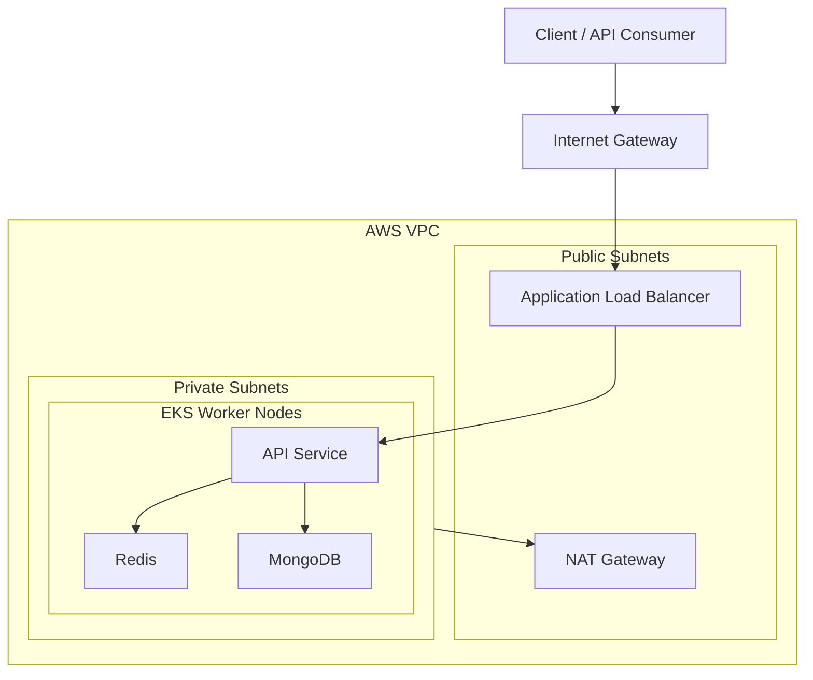

# Session Management API

A Flask-based service for creating, retrieving, and deleting user sessions using MongoDB for persistent storage and Redis for high-performance caching, fully containerized with Docker, orchestrated using Kubernetes, and deployed to AWS EKS via Terraform.

## Features

### API Functionality
- Create, fetch, and delete session documents
- Sliding expiration using TTL refresh on access
- Hybrid storage system:
  - Redis → high-speed in-memory caching
  - MongoDB → persistent session store

### DevOps & Infrastructure
- Dockerized services: Flask API, MongoDB, Redis
- Docker Compose for local multi-container development
- Kubernetes Deployments & Services for all components (Docker Desktop cluster)
- Terraform IaC provisioning:
  - VPC, subnets, routing
  - EKS cluster, managed node groups
  - Automated cluster provisioning and repeatable deployments
- Horizontal scaling through Kubernetes replica sets

### Engineering Focus
- Multi-layer caching design (Redis → MongoDB)
- Session lifecycle + TTL synchronization
- Cloud architecture practice: containers, orchestration, IaC, EKS networking


## Architecture Overview


## Project Structure
```
session-api/
├── app/
│   ├── app.py
│   ├── requirements.txt
│   ├── Dockerfile
├── k8s/
│   ├── api-deployment.yaml
│   ├── api-service.yaml
│   ├── redis-deployment.yaml
│   ├── redis-service.yaml
│   ├── mongo-deployment.yaml
│   ├── mongo-service.yaml
├── terraform/
│   ├── modules/
│   │   ├── vpc
│   │   ├── eks
│   ├── main.tf
│   ├── variables.tf
│   ├── outputs.tf
├── .env
├── docker-compose.yml
└── README.md
```
